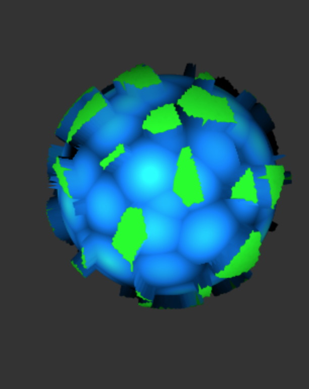
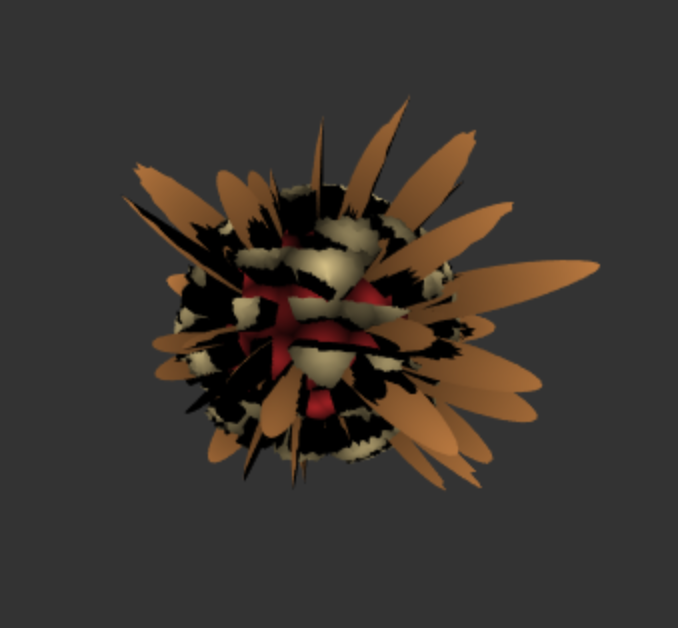

# Isabela Rovira || irovira
## Resources
Book of Shaders:
Worley noise
https://thebookofshaders.com/12/
https://thebookofshaders.com/edit.php#12/3d-cnoise.frag

Rotation
http://www.neilmendoza.com/glsl-rotation-about-an-arbitrary-axis/

## Screenshots

## Explanation

Earth-like Planet:
- I used Worley Noise to partition the planet into sections of different textures. I determined the sections based on the closest neighbor found with Worley. Then, in my vertex shader, I modified the positions based on Absolute Value Perlin Noise or Worley noise.
-The worleyScale parameter in the GUI changes the scale of the worley cells, thus creating smaller and more scattered continents on the surface
-The speed parameter changes the rate of rotation for the planet.

Ice and Rock Moons:
-Both of these planets used the same subdivision technique as the earthlike planets but with different parameters for the biomes. They also adjust vertex positions differently.
-The moon type pararmeter in the GUI changes the shader for the moon geometry.

